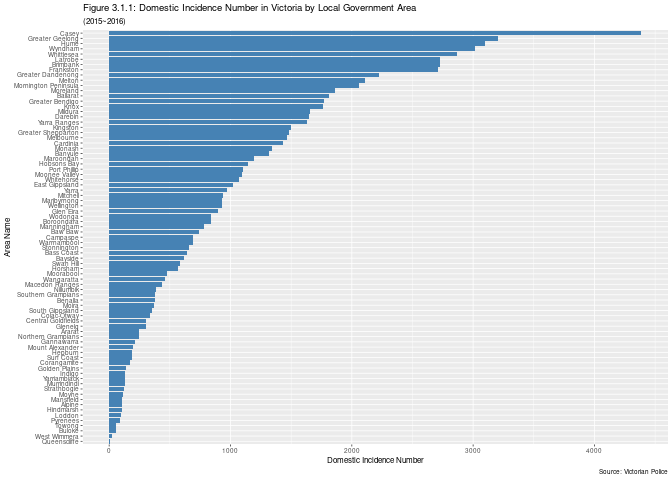
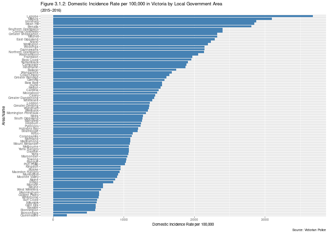
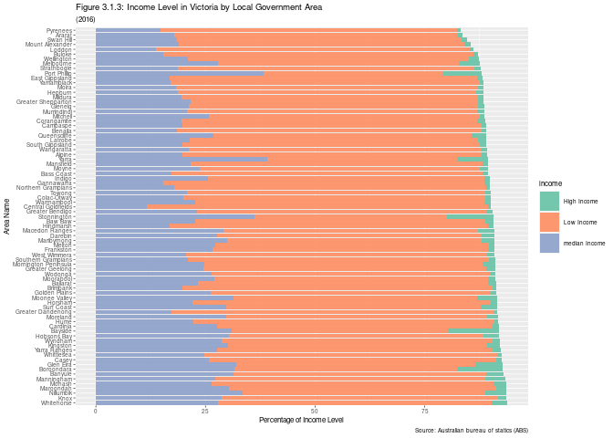
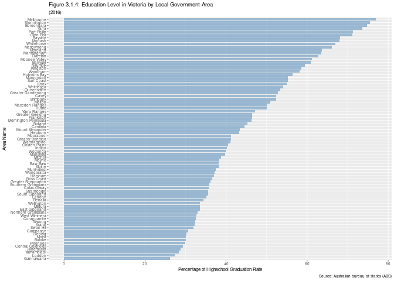
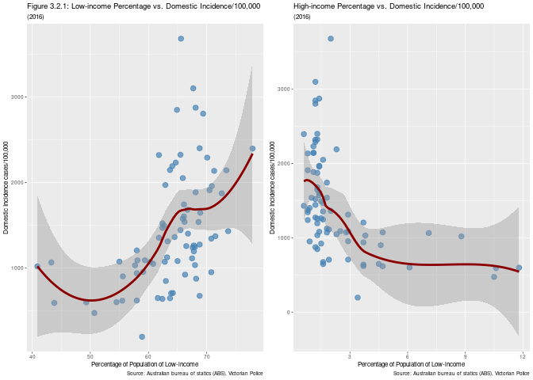
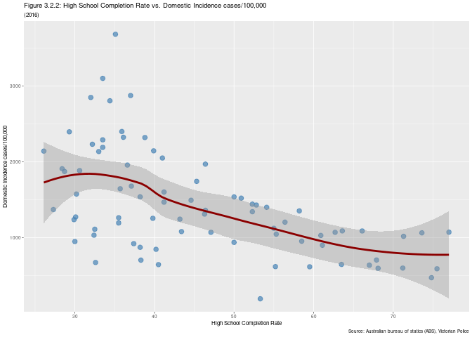
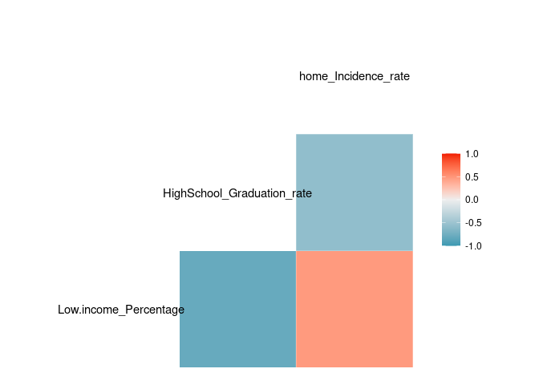

Report on Examing the Effect of Income, Education on Domestic Incidence
Rate
================
Junyou Chen
2/23/2022

-   [1. Introduction](#1-introduction)
    -   [1.1 Research question](#11-research-question)
-   [2. Data](#2-data)
    -   [2.1 Dataset](#21-dataset)
    -   [2.2 Data Wrangling](#22-data-wrangling)
-   [3 Analysis](#3-analysis)
    -   [3.1 Descriptive Analysis](#31-descriptive-analysis)
        -   [3.1.1 Domestic Incidence in Victoria by Local Government
            Area](#311-domestic-incidence-in-victoria-by-local-government-area)
        -   [3.1.2 Domestic Incidence per 100,000 in Victoria by Local
            Government
            Area](#312-domestic-incidence-per-100000-in-victoria-by-local-government-area)
        -   [3.1.3 Income Level in Victoria by Local Government
            Area](#313-income-level-in-victoria-by-local-government-area)
        -   [3.1.4 Highschool Graduation Rate by Local Government
            Area](#314-highschool-graduation-rate-by-local-government-area)
    -   [3.2 Correlation Analysis](#32-correlation-analysis)
        -   [3.2.1 Income level vs. Number of Domestic
            Incidence](#321-income-level-vs-number-of-domestic-incidence)
        -   [3.2.2 High School Completion Rate vs. Number of Domestic
            Incidence](#322-high-school-completion-rate-vs-number-of-domestic-incidence)
-   [4 Summary](#4-summary)

# 1. Introduction

## 1.1 Research question

‘Family incidents’ recorded by Victoria Police increased by 6.7 percent
from 82,651 in 2018–19 to 88,214 in 2019–20 (a 5% increase in the rate
of incidents per 100,000 people), affecting tens of thousands of
families across Victoria. As a result, I’d like to use the datasets I’ve
acquired to investigate possible causes of domestic violence across
Victoria, allowing policymakers to make more informed
decisions.Therefore, my research question is, Do income level and
education level have effects on domestic incidence rate? To examine the
possible impact of income and education on domestic incidence, I have
chosen Victoria state, Australia, as my research setting to conduct the
analysis. I wish to find possible correlations between income, education
and family violence for policy makers to make more effective policies
targeting the issue.

# 2. Data

## 2.1 Dataset

As the census data for year 2021 is not yet available in
[Aurin](https://portal.aurin.org.au/), I’ve chosen most recent census
data in 2016 to conduct the analysis. To keep the consistency of the
data, I also ajusted the domestic violence data to year 2016.

**V_Police_Data_2012-17.xlsx** Bureau of crime statistics data sheet on
victims of domestic violence recorded by [Victorian
police](https://www.crimestatistics.vic.gov.au/family-violence-data-portal/download-data-tables).This
includes data recorded between July 2012 and July 2017, and 21 data
sheets on many different aspects of domestic violence cases reported to
the police, including the gender and age of affected members, children’s
participation in domestic violence cases, etc. However, the main data of
this study are **Table 2** and **Table 3**.

**Table 2** has been stored as family_incidence, including family event
data recorded in police areas and local government areas from July 2012
to June 2017.

**Table 3** has been stored as family_incidence_rate, including the data
of household accident rate per 100000 population divided by police
district and local government area from July 2012 to June 2017.

**AURIN_dataset.csv** A datasheet from the Australian bureau of statics
(ABS) that records the income, education, employability and health
statistics by LGA (local government area). For this investigation, we
are only interested in certain variables including (for a person over
the age of 15): completed school years and the weekly total personal
income for residence in victoria, Australia. The data are collected by
the ABS from the 2016 census of Population and Housing.

## 2.2 Data Wrangling

There are in total 79 Local Government Area(LGA) in Victoria. The
following head of the table joined the table from
V_Police_Data_2012-17.xlsx and AURIN_dataset.csv, and summarized
different income levels and high school graudation rate in each region
of Victoria. People earning weekly negative to 999AUD are identified as
low income family, people earning weekly 1000AUD to 2999AUD are
identified as median income family while people earning weekly over
3000AUD are identified as high income family.

| region_name | low_income | median_income | high_income | graduated | ungraduated | family_incidents | fincident_rate |
|:------------|-----------:|--------------:|------------:|----------:|------------:|-----------------:|---------------:|
| Alpine      |       68.2 |          19.8 |         1.2 |      38.2 |        50.5 |              105 |          874.3 |
| Ararat      |       64.7 |          17.8 |         1.1 |      32.2 |        51.2 |              246 |         2231.9 |
| Ballarat    |       66.1 |          23.3 |         1.8 |      45.3 |        46.1 |             1812 |         1742.9 |
| Banyule     |       57.7 |          31.4 |         3.8 |      60.9 |        32.8 |             1317 |         1030.6 |
| Bass Coast  |       70.9 |          17.2 |         1.4 |      36.6 |        52.6 |              643 |         1957.5 |
| Baw Baw     |       66.2 |          22.6 |         1.8 |      38.2 |        52.8 |              740 |         1539.4 |

# 3 Analysis

## 3.1 Descriptive Analysis

### 3.1.1 Domestic Incidence in Victoria by Local Government Area

As we can see from the graph, among 79 LGAs, Casey(4387) has the highest
domestic incidence number in year 2016 while Queenscliffe(6) has the
lowest domestic incidence number. The average number of domestic
incidence happened in Victoria in 2016 is 985.

### 3.1.2 Domestic Incidence per 100,000 in Victoria by Local Government Area

As we can see from the graph, among 79 LGAs, Latrobe(3681) has the
highest number of domestic incidence per 100,000 persons in year 2016
while Queenscliffe(195.5) has the lowest. The average number of domestic
incidence per 100,000 persosn happened in Victoria in 2016 is 1431.

### 3.1.3 Income Level in Victoria by Local Government Area

*(The columns might not add up to 100% due to non-response rate or have
been tweaked done by the Australian Bureau of Statistics out of the
concern to protect confidentiality)*

For income level in State of Victoria, among 79 LGAs, people of
low-income occupied a large proportion in regards of total population.
The average percent of low-income population for 79 LGAs in Victoria
State is 63.6%, while 24.2% for median-income population and 2.5% for
high-income population.

### 3.1.4 Highschool Graduation Rate by Local Government Area

*(The columns might not add up to 100% due to non-response rate or have
been tweaked done by the Australian Bureau of Statistics out of the
concern to protect confidentiality)*

For highschool graduation rate, in the graph blue represents percentage
of highschool graduation rate, among 79 LGAs, Melbourne(77%) has the
highest high school graduation rate while Gannawarra(26.1%) has the
lowest. The average high school graduation rate for the state of
Victoria is 49.9%.

## 3.2 Correlation Analysis

### 3.2.1 Income level vs. Number of Domestic Incidence

Scatterplot can be plotted to examine the relationship between income
levels and domestic incidence numbers per 100,000 people. The first
graph examined the relationship between the percentage of population of
low-income and domestic incidence numbers per 100,000 people. As the
graph shows, generally speaking, higher rate of low-income population is
correlated to more numbers of domestic incidence per 100,000 people. In
other words, domestic incidence is more likely to happen in an area with
higher percentage of low-income populations. Same scatterplot can be
also plotted to examine the relationship between the percentage of
population of high-income and domestic incidence numbers per 100,000
people to further verify the result from the opposite direction. As the
second graph demonstrates, domestic incidence is less likely to happen
in an area with higher percentage of high-income populations, which
keeps in accordance with the initial graph.

**Pearson’s r**

To further examine the correlation between the income level and domestic
incidence numbers per 100,000 people from statistical point, Pearson’s r
can be conducted. As the result shows, the correlation between the
percentage of population of low-income and domestic incidence numbers
per 100,000 people is statistically significant *(p\<0.01)* and is
considered moderate in terms of strength (r = 0.48). In other words, the
percentage of population of low-income in the region is positively
related to the number of domestic incidence per 100,000 persons.

| id  |  estimate | statistic | p.value | parameter |  conf.low | conf.high | method                               | alternative |
|:----|----------:|----------:|--------:|----------:|----------:|----------:|:-------------------------------------|:------------|
| c1  | 0.4784327 |  4.780907 | 8.2e-06 |        77 | 0.2877638 | 0.6326204 | Pearson’s product-moment correlation | two.sided   |

### 3.2.2 High School Completion Rate vs. Number of Domestic Incidence

To examine the relationship between high school completion rate and
numbers of domestic incidence, scatterplot can be plotted as below. The
graph indicates that less high school completion rate is associated with
more numbers of domestic incidence per 100,000 people. In other words,
people who have not graduated from high school is correlated to more
likelyhood of getting involved in domestic incidence.

**Pearson’s r**

Pearson’s r is also conducted to examine the correlation. As the result
demonstrate, the correlation between the high school completion rate and
domestic incidence numbers per 100,000 people is statistically
significant *(p\<0.01)* and is considered moderate in terms of strength
(r = -0.57). In other words, high school completion rate is moderately
negatively related to the number of domestic incidence per 100,000
persons.

| id  |   estimate | statistic | p.value | parameter |   conf.low |  conf.high | method                               | alternative |
|:----|-----------:|----------:|--------:|----------:|-----------:|-----------:|:-------------------------------------|:------------|
| c2  | -0.5703747 | -6.093391 |       0 |        77 | -0.7028452 | -0.3996688 | Pearson’s product-moment correlation | two.sided   |

**Correlation coefficient matrix**

# 4 Summary

From the analysis, it has been visually and statistically proven that
domestic incidence is more likely to occur in places with higher rate of
low-income populations and as well low high school completion rate. The
reason might be first, low-income population is more likely to encounter
things that may stimulate conflicts, and the resulting negative emotions
may lead to a series of violent acts, including provoking domestic
violence; second, people with low education generally mean low social
skills, lower income and are usually associated with the low-income
population, as shown in the Correlation coefficient matrix draw Above,
therefore they might be ignorant of the negative outcome associated with
domestic violence and hence might more likely to commit one. The results
might be spurious in that, first, the data are separately drew from
different database and thus it is skeptical still to directly bind the
data together; second, the number of domestic incidence drew from
Victoria Police department sliced data collected from
June,2015\~June,2016 while the AURIN_dataset drew from census data is
collected in Aug,2016, thus the data might not be perfectly matching
with regards to time.
