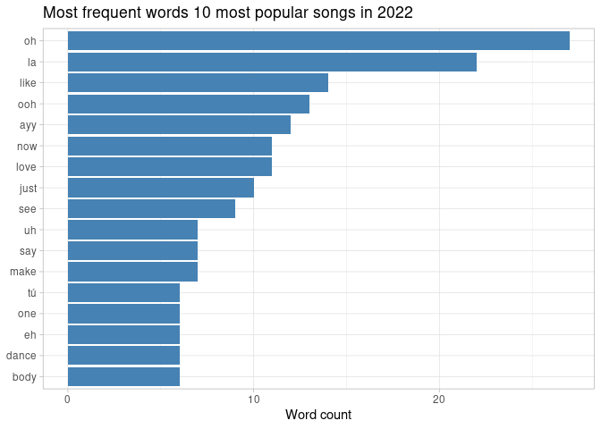
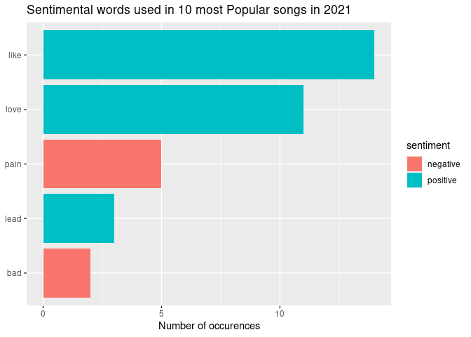
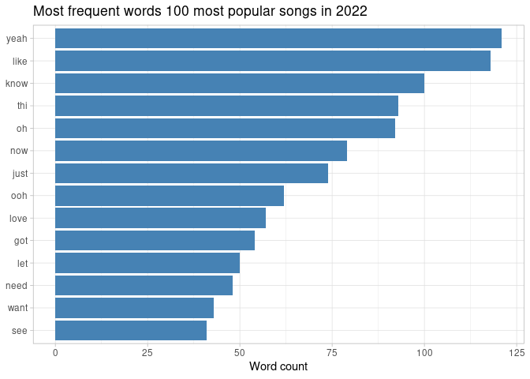
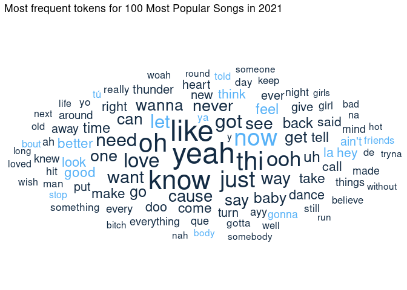
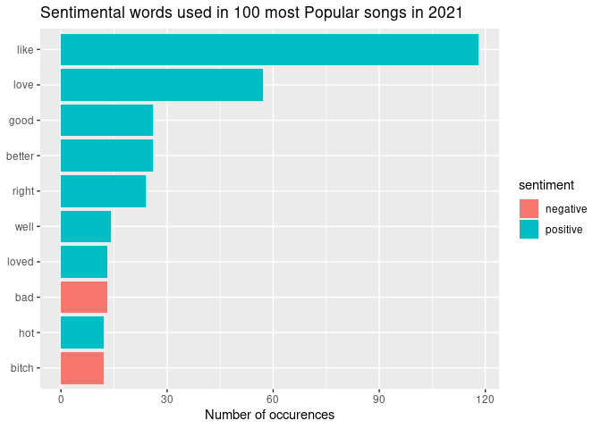

Text Analysis
================
Junyou Chen
3/15/2022

-   [Text Analysis of Lyrics of Most Popular
    Songs](#text-analysis-of-lyrics-of-most-popular-songs)
    -   [Part 1: Text Analysis of the Top Ten
        Songs](#part-1-text-analysis-of-the-top-ten-songs)
        -   [1.1 Most frequent words 10 most popular songs in
            2022](#11-most-frequent-words-10-most-popular-songs-in-2022)
        -   [1.2 Sentimental words used in 10 most Popular songs in
            2022](#12-sentimental-words-used-in-10-most-popular-songs-in-2022)
    -   [Part 2: Text Analysis of the Top 100
        Songs](#part-2-text-analysis-of-the-top-100-songs)
        -   [2.1 Iterating Function](#21-iterating-function)
        -   [2.2 Most frequent words 100 most popular songs in
            2022](#22-most-frequent-words-100-most-popular-songs-in-2022)
        -   [2.3 Create a Wordcloud](#23-create-a-wordcloud)
        -   [2.4 Sentimental words used in 10 most Popular songs in
            2022](#24-sentimental-words-used-in-10-most-popular-songs-in-2022)

# Text Analysis of Lyrics of Most Popular Songs

In this analysis, I used two different ways to extract lyrics from
[Musixmatch](https://developer.musixmatch.com/) to do text analysis.
</br>I used the first method only to extract data for the top ten most
popular songs and the second to extract data for as much as 100 top
popular songs. The analysis I did include: </br>**1. Finding the most
Frequent words appeared in lyrics** </br>**2. Worldcloud** </br>**3.
Sentiment analysis of lyrics**

## Part 1: Text Analysis of the Top Ten Songs

In this part I used [R
wrapper](https://github.com/fernandabruno/musixmatchR) developed by
fernandabruno to extract data from Musixmatch for the recent 10 most
popular songs and binded them together forming a new table. *It should
be noted that as I do not have full access to the musixmatch API, I can
only extract the 30% of lyrics for each song.*

``` r
## set API-key
key <- getOption("musixmatch")

## create a function to extract lyrics with proper name for singer and song 
lyrics_extract <- function(singer, song){
  song <- searchTrack(singer, song, key) %>%
    filter(track_has_lyrics == 1) 
  ##only select songs with lyrics
  song_id <- song[[1]][1] ##extract song_id
  lyrics <- getLyrics(song_id, key) 
  clean_lyrics <- gsub('.{70}$', '', lyrics$lyrics_body)## to clean the data
  return(as.tibble(clean_lyrics))
}
## extract lyrics for 10 most popular songs on spotify
song_1 <- lyrics_extract("Ed Sheeran","Shape of You")
song_2 <- lyrics_extract("The Weeknd","Blinding Lights")
song_3 <- lyrics_extract("Tones and I","Dance Monkey")
song_4 <- lyrics_extract("Post Malone", "Rockstar")
song_5 <- lyrics_extract("Lewis Capaldi", "Someone You Loved")
song_6 <- lyrics_extract("The Chainsmokers","Closer")
song_7 <- lyrics_extract("Post Malone","Sunflower")
song_8 <- lyrics_extract("Shawn Mendes", "Señorita")
song_9 <- lyrics_extract("Imagine Dragons", "Believer")
song_10 <- lyrics_extract("Billie Eilish", "Bad Guy")

lyrics_total <- bind_rows(song_1, song_2, song_3, song_4, song_5, song_6, song_7, song_8, song_9, song_10) 

kable(head(lyrics_total))
```

| value                                                                                                                                                                                                                                                                                                                                                                                                                                                                                                                                                                                                                                                                                                                                                                                                                                                                                                                                                                                                                                                       |
|:------------------------------------------------------------------------------------------------------------------------------------------------------------------------------------------------------------------------------------------------------------------------------------------------------------------------------------------------------------------------------------------------------------------------------------------------------------------------------------------------------------------------------------------------------------------------------------------------------------------------------------------------------------------------------------------------------------------------------------------------------------------------------------------------------------------------------------------------------------------------------------------------------------------------------------------------------------------------------------------------------------------------------------------------------------|
| The club isn’t the best place to find a lover So the bar is where I go Me and my friends at the table doing shots Drinking fast, and then we talk slow And you come over and start up a conversation with just me And trust me, I’ll give it a chance now Take my hand, stop Put “Van the Man” on the jukebox And then we start to dance And now I’m singing like Girl, you know I want your love Your love was handmade for somebody like me Come on now, follow my lead I may be crazy, don’t mind me Say: “Boy, let’s not talk too much Grab on my waist and put that body on me” Come on now, follow my lead Come, come on now, follow my lead I’m in love with the shape of you We push and pull like a magnet do Although my heart is falling too I’m in love with your body Last night you were in my room And now my bed sheets smell like you Every day discovering something brand new Oh, I’m in love with your body Oh-i-oh-i-oh-i-oh-i Oh, I’m in love with your body Oh-i-oh-i-oh-i-oh-i Oh, I’m in love with your body Oh-i-oh-i-oh-i-oh-i … |
| Yeah I’ve been tryna call I’ve been on my own for long enough Maybe you can show me how to love, maybe I’m going through withdrawals You don’t even have to do too much You can turn me on with just a touch, baby I look around and Sin City’s cold and empty (oh) No one’s around to judge me (oh) I can’t see clearly when you’re gone I said, ooh, I’m blinded by the lights …                                                                                                                                                                                                                                                                                                                                                                                                                                                                                                                                                                                                                                                                          |
| They say, “Oh my God, I see the way you shine” “Take your hands, my dear, and place them both in mine” You know you stopped me dead while I was passing by And now I beg to see you dance just one more time Ooh, I see you, see you, see you every time And oh my, I, I, I like your style You, you make me, make me, make me wanna cry And now I beg to see you dance just one more time So they say “Dance for me, dance for me, dance for me, oh-oh-oh” “I’ve never seen anybody do the things you do before” They say “Move for me, move for me, move for me, ayy-ayy-ayy” “And when you’re done, I’ll make you do it all again” I said, “Oh my God, I see you walking by” “Take my hands, my dear, and look me in my eyes” Just like a monkey I’ve been dancin’ my whole life …                                                                                                                                                                                                                                                                       |
| Hahahahaha Tank God Ayy, ayy I’ve been fuckin’ hoes and poppin’ pillies Man, I feel just like a rockstar (ayy, ayy) All my brothers got that gas And they always be smokin’ like a Rasta Fuckin’ with me, call up on a Uzi And show up, man, them the shottas When my homies pull up on your block They make that thing go grrra-ta-ta-ta (ta, pow, pow, pow, ayy, ayy) Switch my whip, came back in black I’m startin’ sayin’, “Rest in peace to Bon Scott” (Scott, ayy) Close that door, we blowin’ smoke She ask me light a fire like I’m Morrison (‘son, ayy) Act a fool on stage Prolly leave my fuckin’ show in a cop car (car, ayy) Shit was legendary Threw a TV out the window of the Montage Cocaine on the table, liquor pourin’, don’t give a damn Dude, your girlfriend is a groupie, she just tryna get in …                                                                                                                                                                                                                                  |
| I’m going under and this time I fear there’s no one to save me This all or nothing really got a way of driving me crazy I need somebody to heal, somebody to know Somebody to have, somebody to hold It’s easy to say, but it’s never the same I guess I kinda liked the way you numbed all the pain Now the day bleeds into nightfall And you’re not here to get me through it all I let my guard down, and then you pulled the rug I was getting kinda used to being someone you loved I’m going under and this time I fear there’s no one to turn to …                                                                                                                                                                                                                                                                                                                                                                                                                                                                                                   |
| Hey, I was doing just fine before I met you I drink too much and that’s an issue, but I’m okay Hey, you tell your friends it was nice to meet them But I hope I never see them again I know it breaks your heart Moved to the city in a broke down car And four years, no calls Now you’re looking pretty in a hotel bar And I can’t stop No, I can’t stop So baby, pull me closer in the back-seat of your Rover That I know you can’t afford Bite that tattoo on your shoulder Pull the sheets right off the corner Of the mattress that you stole From your roommate back in Boulder We ain’t ever getting older …                                                                                                                                                                                                                                                                                                                                                                                                                                       |

### 1.1 Most frequent words 10 most popular songs in 2022

In this part, I tokenized lyrics to find the most frequent words
appeared in 10 most popular songs in 2022. As we can see from the
result, the most frequently used top three words respectively are **oh,
la, like**.

``` r
 ## tokenize
lyrics_unigrams <- unnest_tokens(
  tbl = lyrics_total,
  output = word,
  input = value)
## remove stop words
lyrics_unigrams$word_less<-removeWords(lyrics_unigrams$word,stopwords(c("","en")))

## What are most appeared word? 
word_counts <- lyrics_unigrams %>% 
    count(word_less) %>% 
  filter(n < 200) %>%
    arrange(desc(n)) %>%
    slice_max(order_by = n, n = 15) %>%
  # create barplot
    ggplot(aes(x = reorder(word_less, n), y = n)) +
    geom_col(fill = "steelblue") +
    scale_x_reordered() +
    labs(
      title = "Most frequent words 10 most popular songs in 2022",
      x = NULL,
      y = "Word count"
  ) +
  coord_flip() +
  theme_light()
word_counts
```

<!-- -->

### 1.2 Sentimental words used in 10 most Popular songs in 2022

If we further investigate the sentiment tendency of the top 10 songs, we
can notice that **like** ranked the first. three out of five words are
positive.

``` r
# Generate data frame with sentiment derived from the Bing dictionary
music_bing <- lyrics_unigrams %>%
  inner_join(get_sentiments("bing"), by = "word")
music_bing %>%
  group_by(sentiment) %>%
  count(word) %>%
  arrange(-n) %>%
  head(5) %>%
  # generate the bar plot
  ggplot(aes(x = reorder(word, n), n, fill = sentiment)) +
  geom_col() +
  labs(
    title = "Sentimental words used in 10 most Popular songs in 2021",
    x = NULL,
    y = "Number of occurences"
  ) +
  coord_flip()
```

<!-- -->

## Part 2: Text Analysis of the Top 100 Songs

However, as we can notice, 10 songs in far from enough to do text
analysis and not representative enough. </br> Therefore, I download a
[csv.file](https://github.com/JunyouC/hw09/blob/main/songs.csv)
including song names and singers of the most recent top 100 popular
songs to do the analysis.

``` r
song100 <- read_csv(here("songs.csv"))
## delete "" in name column
song100$name <- substring(song100$name,2) 
song100$name <- substr(song100$name,1,nchar(song100$name)-1)
kable(head(song100))
```

| rank | name              | singer        |
|-----:|:------------------|:--------------|
|    1 | Shape of You      | Ed Sheeran    |
|    2 | Blinding Lights   | The Weeknd    |
|    3 | Dance Monkey      | Tones and I   |
|    4 | Rockstar          | Post Malone   |
|    5 | Someone You Loved | Lewis Capaldi |
|    6 | One Dance         | Drake         |

### 2.1 Iterating Function

In this part, I wrote a function that would return automatically a
tableframe with all informations of the song including lyrics once you
input name of the song and singer. Then I iterate the cleaned
[csv.file](https://github.com/JunyouC/hw09/blob/main/songs.csv) using
the function i’ve created and map2_dfr to create a dataframe to store
informations for all 100 songs.  
The table below only exhibited the first 2 rows of the full table.

``` r
## create a function that would return more infos.
lyrics_extract2 <- function(song, singer){
  song <- searchTrack(singer, song, key) %>%
    filter(track_has_lyrics == 1) 
  ##only select songs with lyrics
  song_id <- song[[1]][1] ##extract song_id
  lyrics <- getLyrics(song_id, key) 
  lyrics$lyrics_body <- gsub('.{58}$', '', lyrics$lyrics_body)## to clean the data
  song_tb <- inner_join(song, lyrics, by = "track_id") %>%
    select(-c(track_rating,track_has_lyrics,track_numfavourite,explicit.x,explicit.y))
  return(song_tb)
}

## Map over multiple inputs simultaneously.
songs100<-song100 %>%
  filter(rank != 6) %>%
  filter(rank <= 100) %>%
  select(-rank)

full_table<- map2_dfr(songs100$name, songs100$singer, lyrics_extract2)

kable(head(full_table,2))
```

|  track_id | track_name      | album_name     | album_id | artist_name                                                    | artist_id | lyrics_id | lyrics_body                                                                                                                                                                                                                                                                                                                                                                                                                                                                                                                                                                                                                                                                                                                                                                                                                                                                                                                                                                                                                                                                    |
|----------:|:----------------|:---------------|---------:|:---------------------------------------------------------------|----------:|----------:|:-------------------------------------------------------------------------------------------------------------------------------------------------------------------------------------------------------------------------------------------------------------------------------------------------------------------------------------------------------------------------------------------------------------------------------------------------------------------------------------------------------------------------------------------------------------------------------------------------------------------------------------------------------------------------------------------------------------------------------------------------------------------------------------------------------------------------------------------------------------------------------------------------------------------------------------------------------------------------------------------------------------------------------------------------------------------------------|
| 130195535 | Shape Of You    | Peaceful Piano | 26176988 | Ed Sheeran feat. John McDaid, Steve Mac & Music Lab Collective |  40653378 |  17195099 | The club isn’t the best place to find a lover So the bar is where I go Me and my friends at the table doing shots Drinking fast, and then we talk slow And you come over and start up a conversation with just me And trust me, I’ll give it a chance now Take my hand, stop Put “Van the Man” on the jukebox And then we start to dance And now I’m singing like Girl, you know I want your love Your love was handmade for somebody like me Come on now, follow my lead I may be crazy, don’t mind me Say: “Boy, let’s not talk too much Grab on my waist and put that body on me” Come on now, follow my lead Come, come on now, follow my lead I’m in love with the shape of you We push and pull like a magnet do Although my heart is falling too I’m in love with your body Last night you were in my room And now my bed sheets smell like you Every day discovering something brand new Oh, I’m in love with your body Oh-i-oh-i-oh-i-oh-i Oh, I’m in love with your body Oh-i-oh-i-oh-i-oh-i Oh, I’m in love with your body Oh-i-oh-i-oh-i-oh-i … \*\*\*\*\*\*\* Thi |
| 194169151 | Blinding Lights | After Hours    | 37216011 | The Weeknd                                                     |  13937035 |  26639979 | Yeah I’ve been tryna call I’ve been on my own for long enough Maybe you can show me how to love, maybe I’m going through withdrawals You don’t even have to do too much You can turn me on with just a touch, baby I look around and Sin City’s cold and empty (oh) No one’s around to judge me (oh) I can’t see clearly when you’re gone I said, ooh, I’m blinded by the lights … \*\*\*\*\*\*\* Thi                                                                                                                                                                                                                                                                                                                                                                                                                                                                                                                                                                                                                                                                          |

### 2.2 Most frequent words 100 most popular songs in 2022

In this part, I tokenized lyrics to find the most frequent words
appeared in 10 most popular songs in 2022. As we can see from the
result, the most frequently used top three words respectively are **oh,
la, like**. As we can see from the graph, as we elevate the number of
total song, the results become also more representative than before in
terms of number. the most frequently used top three words become **yeah,
like, know**, instead of **oh, la, like**. It is worth noting that
**like** up ranked one row.

``` r
## tokenize
lyrics_unigrams2 <- unnest_tokens(
  tbl = full_table,
  output = word,
  input = lyrics_body) 
lyrics_unigrams2$word_less<-removeWords(lyrics_unigrams2$word,stopwords(c("","en"))) ## remove stop words 
  

## What are most appeared word? 
word_counts2 <- lyrics_unigrams2 %>% 
    count(word_less) %>% 
    arrange(desc(n)) %>%
    slice_max(order_by = n, n = 15) %>%
    filter(n < 1000) %>%
  # create barplot
    ggplot(aes(x = reorder(word_less, n), y = n)) +
    geom_col(fill = "steelblue") +
    scale_x_reordered() +
    labs(
      title = "Most frequent words 100 most popular songs in 2022",
      x = NULL,
      y = "Word count"
  ) +
  coord_flip() +
  theme_light()
word_counts2
```

<!-- -->

### 2.3 Create a Wordcloud

A worldcloud can be created to better demonstrate the most frequent
words appeared in 100 most popular songs in 2021. As we can see, people
really like onomatopoeia words like **oh**, **yeah**, and they also love
words that are associated with emotions, particular positive ones like
**like**,**love**.

``` r
set.seed(100)
lyrics_unigrams2 %>%
  drop_na(word_less) %>%
  count(word_less) %>%
  # keep top 100 words
  slice_max(order_by = n, n = 100) %>%
  mutate(angle = 45 * sample(c(0, 1), n(), replace = TRUE, prob = c(80, 20))) %>%
  ggplot(aes(label = word_less, size = n, color = angle)) +
  geom_text_wordcloud(rm_outside = TRUE) +
  scale_size_area(max_size = 90) +
  ggtitle("Most frequent tokens for 100 Most Popular Songs in 2021") +
  theme_minimal()
```

<!-- -->

### 2.4 Sentimental words used in 10 most Popular songs in 2022

The sentiment analysis also becomes more representative as we elevate
the number of total song from 10 to 100. </br>**Like** still ranked
first, followed by **love**, **good**. seven out of ten words are
positive.

``` r
# Generate data frame with sentiment derived from the Bing dictionary
music_bing2 <- lyrics_unigrams2 %>%
  inner_join(get_sentiments("bing"), by = "word")
music_bing2 %>%
  group_by(sentiment) %>%
  count(word) %>%
  arrange(-n) %>%
  head(10) %>%
  # generate the bar plot
  ggplot(aes(x = reorder(word, n), n, fill = sentiment)) +
  geom_col() +
  labs(
    title = "Sentimental words used in 100 most Popular songs in 2021",
    x = NULL,
    y = "Number of occurences"
  ) +
  coord_flip()
```

<!-- -->

</br> *it should be restated that text analysis made above are based on
only 30% of full lyrics of each as I have no full access to Musixmatch
(no money!). However, if you are rich enough to subscribe Musixmatch,
you can do full lyrics analysis since all my codes are reproducible (not
without your personal Musixmatch API)*.
