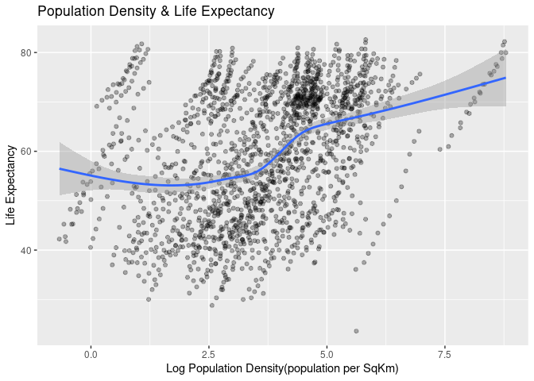
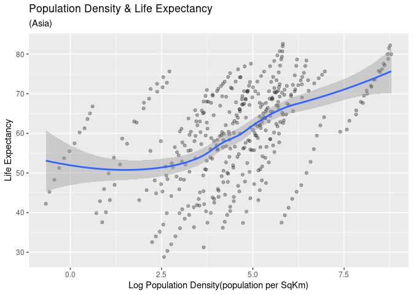
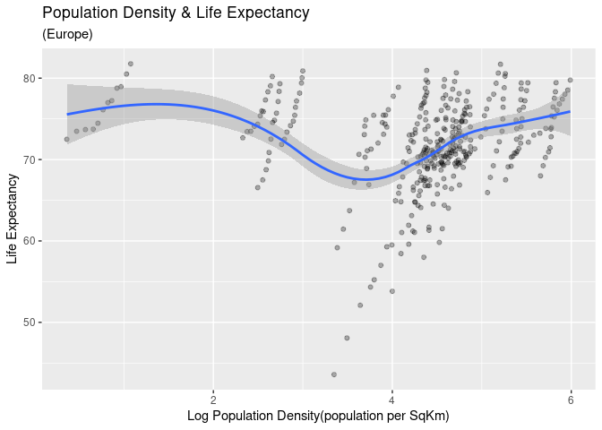
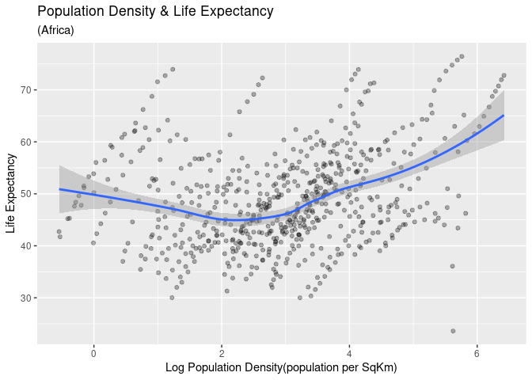
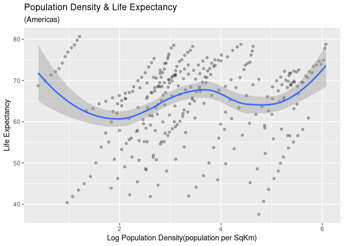
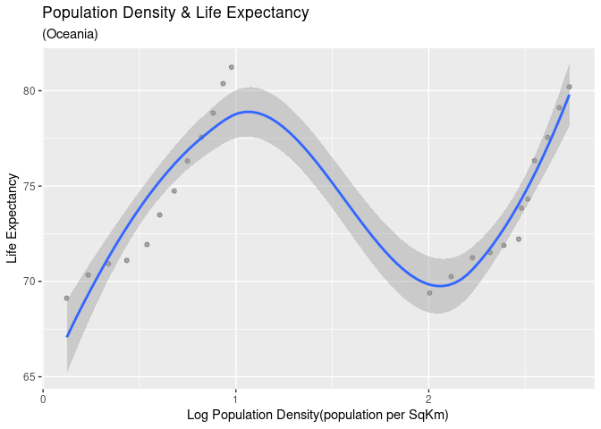

Collecting_analyzing_data_web
================
Junyou Chen
3/4/2022

-   [Part 1](#part-1)
    -   [Assignment Requirement](#assignment-requirement)
    -   [Update the graph (Population Density &
        LifeExpectancy)](#update-the-graph-population-density--lifeexpectancy)
    -   [Pearson’s R](#pearsons-r)
    -   [Correlation Across Continent](#correlation-across-continent)
        -   [Population Density &
            LifeExpectancy(Asia)](#population-density--lifeexpectancyasia)
        -   [Population Density &
            LifeExpectancy(Europe)](#population-density--lifeexpectancyeurope)
        -   [Population Density &
            LifeExpectancy(Africa)](#population-density--lifeexpectancyafrica)
        -   [Population Density &
            LifeExpectancy(Americas)](#population-density--lifeexpectancyamericas)
        -   [Population Density &
            LifeExpectancy(Oceania)](#population-density--lifeexpectancyoceania)
    -   [Pearson’s R (by Continents)](#pearsons-r-by-continents)

## Part 1

### Assignment Requirement

For the assignment, I want you to replace population with population
density and evaluate its relationship with average life expectancy. To
do this:

Get the country information using geonames - remember there is a R
package for this (see the lecture notes) Merge gapminder and the country
information from geonames Use left_join from dplyr to merge the tables
Note that you cannot directly do this - gapminder writes the name of
countries differently from geonames. To complete the merge, you need a
unique key to match observations between the data frames There is neat
little package for R called countrycode that helps solve this problem.
countrycode() takes as an input a country’s name in a specific format
and outputs it using whatever format you specify. gapminder stores them
using the country.name format geonames stores them under the countryCode
column using the iso2c format I leave it to you to make the joining
operation work Calculate the population density for each observation
Produce an updated graph using population density If you want to be real
fancy, estimate a statistical model or compare the relationship across
continents

### Update the graph (Population Density & LifeExpectancy)

``` r
key <- getOption("geonamesUsername")

##scrap information from geoname
countryInfo <- GNcountryInfo() %>%
  as_tibble() %>%
  select("countryCode", "areaInSqKm")

##Create a common variable with the iso3c code in each data frame, merge the data, and create a country identifier
countryInfo$iso3c <- countrycode(countryInfo$countryCode, origin = "iso2c", destination = "iso3c")
gapminder$iso3c   <- countrycode(gapminder$country, origin = "country.name", destination = "iso3c")

##Join 2 dfs together using left_join
full_data <- left_join(gapminder,countryInfo, by = "iso3c")

full_data <- full_data %>%
  mutate(areaInSqKm = as.numeric(as.character(areaInSqKm))) %>%
  mutate(density = pop / areaInSqKm)

full_data %>%
  ## use log() function to make the graph more clear 
  ggplot(mapping = aes(x = log(density), y = lifeExp)) +
  geom_point(alpha = 0.3) +
  geom_smooth() +
  labs(title = "Population Density & Life Expectancy",
    x = "Log Population Density(population per SqKm)",
    y = "Life Expectancy") 
```

<!-- --> As we
can see on the graph, generally speaking the higher the population
density is, the longer life expectation is. We can further examine the
correlation between population density and life expectancy using
Pearson’s r.

### Pearson’s R

``` r
l <- list(
  c1 = cor.test( ~ density + lifeExp, full_data)
)
c_df <- map_dfr(l,tidy,.id = 'id')
c_df %>%
  kable()
```

| id  |  estimate | statistic | p.value | parameter |  conf.low | conf.high | method                               | alternative |
|:----|----------:|----------:|--------:|----------:|----------:|----------:|:-------------------------------------|:------------|
| c1  | 0.2017928 |  8.499882 |       0 |      1702 | 0.1557994 | 0.2469132 | Pearson’s product-moment correlation | two.sided   |

As the result demonstrate, the correlation between the population
density and life expectancy is statistically significant (p\<0.01) and
is considered weak in terms of strength (r = -0.2). Therefore, we can
say that there is a positive correlation betwee n population density and
life expancy but the correlation is fairly weak.

### Correlation Across Continent

To further examine the correlation, we can compare by different
continents.

#### Population Density & LifeExpectancy(Asia)

``` r
full_data %>%
  filter(continent == "Asia") %>%
  ## use log() function to make the graph more clear 
  ggplot(mapping = aes(x = log(density), y = lifeExp)) +
  geom_point(alpha = 0.3) +
  geom_smooth() +
  labs(title = "Population Density & Life Expectancy",
       subtitle ="(Asia)",
    x = "Log Population Density(population per SqKm)",
    y = "Life Expectancy") 
```

<!-- -->

#### Population Density & LifeExpectancy(Europe)

``` r
full_data %>%
  filter(continent == "Europe") %>%
  ## use log() function to make the graph more clear 
  ggplot(mapping = aes(x = log(density), y = lifeExp)) +
  geom_point(alpha = 0.3) +
  geom_smooth() +
  labs(title = "Population Density & Life Expectancy",
       subtitle ="(Europe)",
    x = "Log Population Density(population per SqKm)",
    y = "Life Expectancy") 
```

<!-- -->

#### Population Density & LifeExpectancy(Africa)

``` r
full_data %>%
  filter(continent == "Africa") %>%
  ## use log() function to make the graph more clear 
  ggplot(mapping = aes(x = log(density), y = lifeExp)) +
  geom_point(alpha = 0.3) +
  geom_smooth() +
  labs(title = "Population Density & Life Expectancy",
       subtitle = "(Africa)",
    x = "Log Population Density(population per SqKm)",
    y = "Life Expectancy") 
```

<!-- -->

#### Population Density & LifeExpectancy(Americas)

``` r
full_data %>%
  filter(continent == "Americas") %>%
  ## use log() function to make the graph more clear 
  ggplot(mapping = aes(x = log(density), y = lifeExp)) +
  geom_point(alpha = 0.3) +
  geom_smooth() +
  labs(title = "Population Density & Life Expectancy",
       subtitle ="(Americas)",
    x = "Log Population Density(population per SqKm)",
    y = "Life Expectancy") 
```

<!-- -->

#### Population Density & LifeExpectancy(Oceania)

``` r
full_data %>%
  filter(continent == "Oceania") %>%
  ## use log() function to make the graph more clear 
  ggplot(mapping = aes(x = log(density), y = lifeExp)) +
  geom_point(alpha = 0.3) +
  geom_smooth() +
  labs(title = "Population Density & Life Expectancy",
       subtitle ="(Oceania)",
    x = "Log Population Density(population per SqKm)",
    y = "Life Expectancy") 
```

<!-- -->

### Pearson’s R (by Continents)

``` r
data_continent <- full_data %>%
  pivot_wider(names_from = continent, values_from = density) %>%
  mutate_if(is.numeric, ~replace(.,is.na(.), 0)) ##replace NA with 0
l <- list(
  asia = cor.test( ~ Asia + lifeExp, data_continent),
  africa = cor.test( ~ Africa + lifeExp, data_continent),
  europe = cor.test( ~ Europe + lifeExp, data_continent),
  americas = cor.test( ~ Americas + lifeExp, data_continent),
  oceania = cor.test( ~ Oceania + lifeExp, data_continent)
)
continent_df <- map_dfr(l,tidy,.id = 'id')
continent_df %>%
  kable()
```

| id       |   estimate | statistic | p.value | parameter |   conf.low |  conf.high | method                               | alternative |
|:---------|-----------:|----------:|--------:|----------:|-----------:|-----------:|:-------------------------------------|:------------|
| asia     |  0.1560072 |  6.515905 | 0.0e+00 |      1702 |  0.1093307 |  0.2019971 | Pearson’s product-moment correlation | two.sided   |
| africa   | -0.1232050 | -5.121881 | 3.0e-07 |      1702 | -0.1696985 | -0.0761642 | Pearson’s product-moment correlation | two.sided   |
| europe   |  0.4079443 | 18.433451 | 0.0e+00 |      1702 |  0.3675786 |  0.4467759 | Pearson’s product-moment correlation | two.sided   |
| americas |  0.1423359 |  5.932513 | 0.0e+00 |      1702 |  0.0954950 |  0.1885479 | Pearson’s product-moment correlation | two.sided   |
| oceania  |  0.1126406 |  4.676787 | 3.1e-06 |      1702 |  0.0655046 |  0.1592751 | Pearson’s product-moment correlation | two.sided   |

As we can see from the results of Pearson’s r for each continent, all
continent examined certain levels of correlation between life expectancy
and population density since P-value \< 0.01. There are 2 things worth
noticing however. First, among 5 continents, only Africa examined
negative correlation. Second, only Europe examined moderate level of
correlation between life expectancy and population density (r = 0.4)
while all other four continent exhibit rather weak correlation
(-0.12\<r\<0.15).
