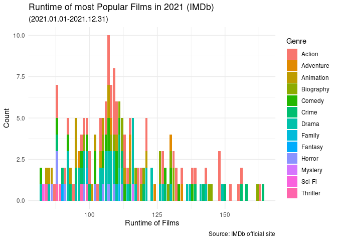
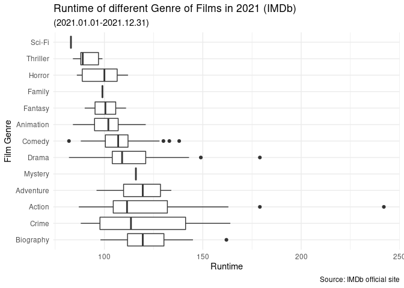
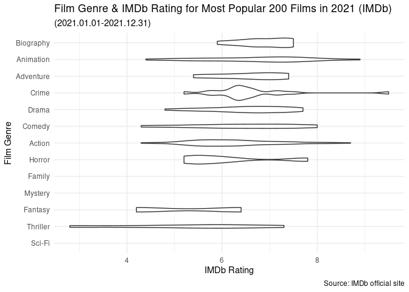
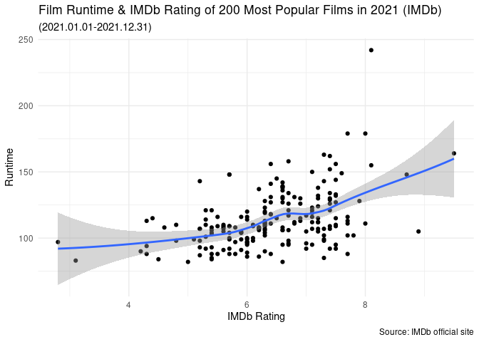
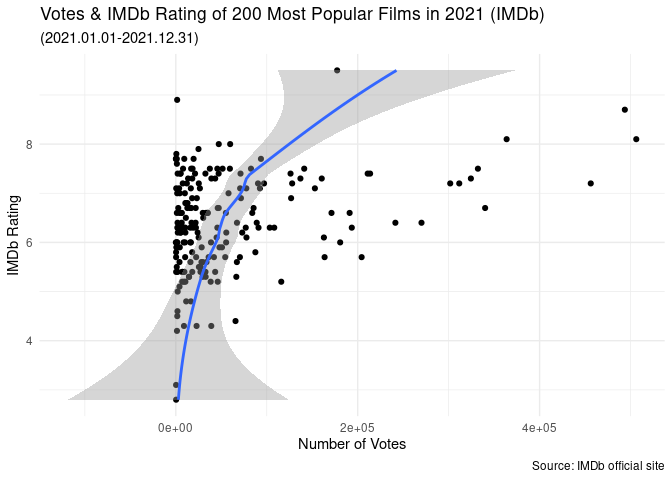
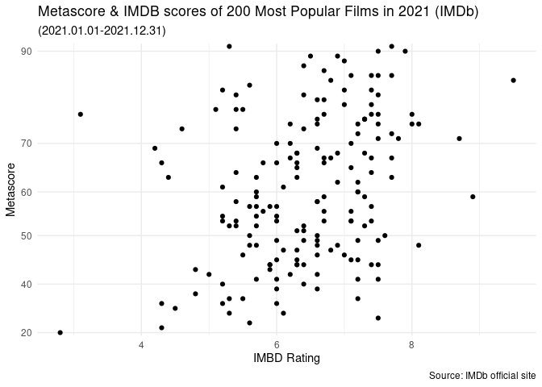

Webscrape_Movie_analysis
================
junyou
2022-03-06

-   [Extract the Data](#extract-the-data)
-   [Data Analysis](#data-analysis)
    -   [1. Do genre of the film have correlation with the runtime
        length of the
        film?](#1-do-genre-of-the-film-have-correlation-with-the-runtime-length-of-the-film)
        -   [Runtime of most Popular Films in
            2021](#runtime-of-most-popular-films-in-2021)
        -   [Runtime of most Popular Films & Film
            Genre](#runtime-of-most-popular-films--film-genre)
    -   [2. What Genre of Film has Higher
        Rating?](#2-what-genre-of-film-has-higher-rating)
        -   [Film Genre & IMDb Rating](#film-genre--imdb-rating)
        -   [Film Runtime & IMDb Rating](#film-runtime--imdb-rating)
    -   [3. Are votes correlated with IMDB
        scores?](#3-are-votes-correlated-with-imdb-scores)
        -   [Votes & IMDb Rating](#votes--imdb-rating)
    -   [4. Are metascore correlated with IMDB
        scores?](#4-are-metascore-correlated-with-imdb-scores)
        -   [Metascore & IMDB scores](#metascore--imdb-scores)

I’ve chosen 200 most popular films from IMDB to do film analysis. I
originally wanted to extract the data from IMDB
[API](http://www.omdbapi.com/). However, it only allows me to draw data
with specific film titles. Therefore, I turned to scrape information for
web page. The code below exhibited the process how I extracted the
ranked most popular 200 films in year 2021 by separately extract data
for several columns including title, runtime, director, etcs.

### Extract the Data

In this part, I first web scraped information for different variables
including rank, title, runtime, genre, votes, IMDB ratings, metascore.
And then I put all data together forming a dataframe to do the analysis.
The table below is the first 6 rows of the tables. The dataframe has
intotal 200 rows including the most 200 popular films rated by IMDB in
year 2021-01-01 to 2021-12-31.

``` r
## finding the 200 most popular movies in year 2021
film <- read_html(x = "https://www.imdb.com/search/title/?title_type=feature&release_date=2021-01-01,2021-12-31&count=200")
## Get rankings 
rank <- html_elements(film,'.text-primary') %>%
  html_text() %>%
  as.numeric()
## get titles
title <- html_elements(film,'.lister-item-header a') %>%
  html_text()
## get runtime
runtime <- html_elements(film,'.text-muted .runtime') %>%
  html_text() %>%
  word(1) %>%
  as.numeric()
## get genre
genre <- html_elements(film, '.genre') %>%
  html_text() %>%
  ### clean genre data and only keep the first one
  str_replace("\n","") %>%
  word(1)

  ### to remove all commas and convert it into factor
clean_genre <- gsub(",","",genre) %>%
  as.factor()
## get director
director <- html_elements(film,'.text-muted+ p a:nth-child(1)') %>%
  html_text() %>%
  as.factor()
## get votes
votes <- html_elements(film,'.sort-num_votes-visible span:nth-child(2)') %>%
  html_text() 
votes <- gsub(",","",votes) %>%
  as.numeric()
## get ratings
rate <- html_elements(film,'.ratings-imdb-rating strong') %>%
  html_text() %>%
  as.numeric()
## get metascore
metascore <- html_elements(film,'.ratings-bar .ratings-metascore') %>%
  html_text() %>%
    str_sub(2) %>%
    word(1) %>%
    as.numeric() %>%
    as.factor()
metascore_df = tibble(metascore)
## write a for loop to add NA to metascore to make the length up to 200
for (i in seq(from = 1, to = 200)){
  if (i %in% c(38,57,67,83,89,101,103,116,119,120,121,123,133,134,144,152,157,160,167,170,171,192,193,199,200)){
     metascore_df <- metascore_df %>% add_row(.before = i, metascore = NA)
  }
}

## combine all data into one film data frame
movies2021_df <- data.frame(Rank = rank,
                            Title = title,
                            Runtime_min = runtime, 
                            Genre = clean_genre, 
                            Rating = rate,
                            Metascore = metascore_df, 
                            Votes = votes, 
                            Director = director)
kable(head(movies2021_df))
```

| Rank | Title                   | Runtime_min | Genre  | Rating | metascore |  Votes | Director             |
|-----:|:------------------------|------------:|:-------|-------:|:----------|-------:|:---------------------|
|    1 | The King’s Man          |         131 | Action |    6.4 | 44        |  88978 | Matthew Vaughn       |
|    2 | West Side Story         |         156 | Crime  |    7.5 | 85        |  45667 | Steven Spielberg     |
|    3 | Free Guy                |         115 | Action |    7.2 | 62        | 301727 | Shawn Levy           |
|    4 | Spider-Man: No Way Home |         148 | Action |    8.7 | 71        | 493728 | Jon Watts            |
|    5 | Licorice Pizza          |         133 | Comedy |    7.5 | 90        |  51457 | Paul Thomas Anderson |
|    6 | The Power of the Dog    |         126 | Drama  |    6.9 | 89        | 126775 | Jane Campion         |

### Data Analysis

To do the data analysis, I would like to ask four questions. <br/>*1. Do
genre of the film have correlation with the runtime length of the film?*
<br/>*2. What genre of film has higher ratings?* <br/>*3. Are metascore
correlated with IMDB scores?* <br/>*4. Are votes correlated with IMDB
scores?*

#### 1. Do genre of the film have correlation with the runtime length of the film?

##### Runtime of most Popular Films in 2021

As we can see from the graph, most films have a runtime around 90 mins
\~ 120 mins.

``` r
movies2021_df %>%
  filter(Runtime_min < 170) %>%
  ggplot(mapping = aes(x = Runtime_min, fill = Genre)) +
  geom_bar(bins = 30) +
  labs(title = "Runtime of most Popular Films in 2021 (IMDb)", subtitle = "(2021.01.01-2021.12.31)", x = "Runtime of Films", y = "Count", caption = "Source: IMDb official site")
```

<!-- -->

##### Runtime of most Popular Films & Film Genre

The following graph plotted a boxplot examining the relationship between
the runtime of film and film genre. As we can see, biography has the
highest mean of film runtime while sci-fi has the lowest. In other
words, biography film tends to be longer than other genre of films.

``` r
movies2021_df %>%
  ggplot(mapping = aes(x = reorder(Genre, desc(Runtime_min)), y = Runtime_min)) +
  geom_boxplot() +
  labs(title = "Runtime of different Genre of Films in 2021 (IMDb)", subtitle = "(2021.01.01-2021.12.31)", x = "Film Genre", y = "Runtime", caption = "Source: IMDb official site") +
  coord_flip()
```

<!-- -->

#### 2. What Genre of Film has Higher Rating?

##### Film Genre & IMDb Rating

Based on a data set of the most popular 200 films in 2021, the following
graph plotted a violin examing the relationship between film genre and
IMDb rating to find out which genre of film tends to have higher rating.
As we can see, Biography film tend to have the average highest rating
while sci-fi has the lowest, which seems can be correlated with the
graph above. It is suspected that film with lower runtime also tends to
have lower rates. However, to examine whether this correlation really
exists or not, we can further plot a scatterplot.

``` r
movies2021_df %>%
  ggplot(mapping = aes(x = reorder(Genre, Rating), y = Rating)) +
  geom_violin() +
  labs(title = "Film Genre & IMDb Rating for Most Popular 200 Films in 2021 (IMDb)", subtitle = "(2021.01.01-2021.12.31)", x = "Film Genre", y = "IMDb Rating", caption = "Source: IMDb official site") +
  coord_flip()
```

<!-- -->

##### Film Runtime & IMDb Rating

It seems that IMDb rating is weakly positively correlated with film
runtime. Pearson’s R can be conducted to examine if this correlation is
statistically significant.

``` r
movies2021_df %>%
  ggplot(mapping = aes(x = Rating, y = Runtime_min)) +
  geom_point() +
  geom_smooth() +
  labs(title = "Film Runtime & IMDb Rating of 200 Most Popular Films in 2021 (IMDb)", subtitle = "(2021.01.01-2021.12.31)", x = "IMDb Rating", y = "Runtime", caption = "Source: IMDb official site")
```

<!-- -->

**Pearson’s R** As the result shows, the correlation between the runtime
of the film and domestic IMDb rating is statistically significant
*(p\<0.01)* and is considered moderate in terms of strength (r = 0.45).
In other words, the longer the film run, the higher IMDb rating it tends
to receive.

``` r
library(broom)
c1 = cor.test( ~ Rating + Runtime_min, movies2021_df) %>% list()
c_df <- map_dfr(c1,tidy,.id = 'id')
kable(c_df)
```

| id  |  estimate | statistic | p.value | parameter |  conf.low | conf.high | method                               | alternative |
|:----|----------:|----------:|--------:|----------:|----------:|----------:|:-------------------------------------|:------------|
| 1   | 0.4552074 |  7.193891 |       0 |       198 | 0.3378005 | 0.5586654 | Pearson’s product-moment correlation | two.sided   |

#### 3. Are votes correlated with IMDB scores?

##### Votes & IMDb Rating

While ratings are based on simple numeric votes cast by users for a
title, user reviews are written essays, in which IMDb users explain what
they liked or disliked about a title and offer other criticism.
Therefore, I am also curious to know if numbers of voting will affect
IMDb rating.

``` r
movies2021_df %>%
  ggplot(mapping = aes(x = Rating, y = Votes)) +
  geom_point() +
  geom_smooth() +
  labs(title = "Votes & IMDb Rating of 200 Most Popular Films in 2021 (IMDb)", subtitle = "(2021.01.01-2021.12.31)", x = "IMDb Rating", y = "Number of Votes", caption = "Source: IMDb official site") +
  coord_flip()
```

<!-- -->

As we can see from the graph, number of votes is somewhat correlated
with IMDb rating. And the less votes a film has, the more dispersed the
rating is likely to be. That make intuitive sense in that people tend to
watch more movies with higher reputation. Therefore more people is going
to vote for that same film, forming a virtues cycle.

#### 4. Are metascore correlated with IMDB scores?

The IMDb score is generated by the IMDb user ratings while the Metascore
ratings are the scores from the website Metacritic.com.Metascores are
given by movie critics and the weighted score(based on the fame of the
critic) is finally assigned.Usually,“very good”(critical favorites)
movies have scores above 70. Therefore, I would like to examine if
metascore is correlated with IMDB scores to see if IMDB score is a good
indicator to predict if a film is good or not.

##### Metascore & IMDB scores

As we can see from the graph, Metascore is positively correlated with
IMDB scores. Therefore, metascore and IMDB scores stay consistent most
of the time in evaluating films.

``` r
movies2021_df %>%
  filter(!is.na(metascore)) %>%
  ggplot(mapping = aes(x = metascore, y = Rating)) +
  geom_point() +
  scale_x_discrete(breaks = seq(0, 100, by = 10)) + ## change interval of x-axis
  labs(title = "Metascore & IMDB scores of 200 Most Popular Films in 2021 (IMDb)", subtitle = "(2021.01.01-2021.12.31)", x = "Metascore", y = "IMBD Rating", caption = "Source: IMDb official site") +
  coord_flip()
```

<!-- -->
